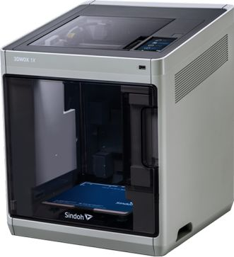
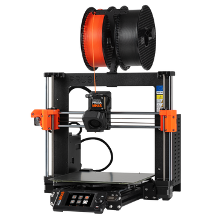

#**TUTORIAL DE USO DE IMPRESORAS 3D IDIT**

##Impresoras 3D IBERO Puebla 

###ENDER 3 S1 PRO

<!-- Control de tamaño usando HTML (cuando se requiera) -->

  + **Tecnología de impresión:** FDM
  + **Volumen de impresión:** 220 x 220 x 270 mm
  + **Velocidad de impresión:** 150 mm/s
  + **XY resolución n:** ± 0.1 mm
  + **Altura de capa:** 0.05 - 0.4 mm
  + **Temperatura de la boquilla:** Más de 300° C
  + **Materiales:** PLA, ABS, PETG, TPU, PA, WOOD

 ###SINDOH 3DWOX 

<!-- Control de tamaño usando HTML (cuando se requiera) -->

  
+	**Printing Technology:** FDM
+	**Build Volume:** 210 x 200 x 195 mm
+	**Printing Speed:** 200 mm/s
+	**XY resolution:** ± Not Given
+	**Layer Height:** 0.05 - 0.4 mm
+	**Nozzle Temperature:** Up to 270° C
   **Supported Materials:** PLA, ABS, PETG, ASA

 	###Stratasys Dimension 1200es

  <!-- Control de tamaño usando HTML (cuando se requiera) -->

  
+	**Printing Technology:** FFM Fused Filament Fabrication
+	**Build Volume:** 254 x 254 x 305 mm
+	**Printing Speed:** 150 mm/s
+	**XY resolution:** ± Not GIven
+	**Layer Height:** 0.254 - 0.33 mm
+	**Nozzle Temperature:** Not GIVEN
+	**Supported Materials:** ABS, PLA, PET, PC, ASA

 	###PRUSA MK4S
 	<!-- Control de tamaño usando HTML (cuando se requiera) -->

  
+	**Printing Technology:** FDM
+	**Build Volume:** 250 x 210 x 220 mm
+	**Printing Speed:** 600 mm/s
+	**XY resolution:** ± 0.12 mm
+	**Layer Height:** 0.05 - 0.3 mm
+	**Nozzle Temperature:** Max 290° C
+	**Supported Materials:** PLA, PETG, Flex, PVA, PC, PP, CPE, PVB

## **Importante** 
•	-Guarda tu archivo en STL.
1.	Selecciona archivo >Guardar como.
2.	Nombra tu archivo y selecciona Tipo.
3.	Selecciona STL.
4.	Selecciona Opciones (Options).
5.	Cambia las opciones a binario, las unidades que requieres para tu modelo y finalmente cambia la resolución a Personalizada.
6.	Guardar
1.Pasar el archivo de STL a Cura
??? info "Antes de iniciar"
    Instala Ultimaker Cura

1.	Añade tu impresora 3D y coloca sus propiedades.
+ a.	No olvides modificar las propiedades cada que cambies de impresora.
2.	Abre tu archivo STL.
3.	Selecciona tu pieza y si lo requieres, muévela sobre la base .
a.	Si lo necesitas escala tu pieza a la dimensión que deseas.
b.	Esta opción te permite rotar tu pieza.
c.	Si lo necesitas, esta herramienta refleja tu pieza. 
4.	Selecciona la opción de impresión que necesites para tu pieza. 
5.	Selecciona el material y el diámetro del filamento que se utilizara. 
6.	Selecciona la resolución y densidad que quieras que tu pieza tenga.
7.	Una vez que hayas modificado todas las propiedades, selecciona Slice.
a.	En la parte inferior, aparecerá el tiempo que requerirá tu pieza para imprimirse
8.	Una vez que tengas la configuración correcta de tu pieza puedes verificar el recorrido que hará la máquina para imprimirla en “Preview”.
9.	Te debe salir una ventana en donde debes seleccionar Line type para que puedas ver el recorrido de la impresora con el control que está a la derecha de la pantalla.
10.	Selecciona Save to Disk > Selecciona la carpeta en donde quieras guardar > Guardar.
11.	Verifica que se halla guardado tu archivo con la ventana que aparece abajo.
!!! note "Nota"
    Guarda tu archivo para imprimir en una tarjeta SD, en caso contrario no podrás hacer uso de la impresora. 
!!! warning "Importante"
Cuando hagas uso de las impresoras debes de registrarte en la lista que esta colocada en el mismo estante de las impresoras, escribe: tu nombre, impresora, no° de cuenta, nombre del archivo. En caso de no hacerlo es cancelación de la impresión 

## Encargados 
•	Oliver Ochoa García ( oliver.ochoa2@iberopuebla.mx ) 

