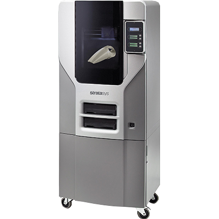

#**PRÁCTICAS PRIMER SEMESTRE**

##Microcontroladores 

##SP32

<!-- Control de tamaño usando HTML (cuando se requiera) -->

  + El ESP32 es un microcontrolador, al igual que el Arduino, pero tiene conectividad Bluetooth y WiFi ya integrada en la placa. Esto facilita mucho los proyectos de IoT, ya que intercambiarán información constantemente con la red.

##Puente H

<!-- Control de tamaño usando HTML (cuando se requiera) -->

  
+	El puente H es un circuito electrónico que se utiliza para controlar el movimiento de motores, en particular motores de corriente continua (DC). Su nombre se debe a la forma típica del circuito, que se asemeja a la letra «H». El principal objetivo del puente H es permitir que un motor gire en ambas direcciones: hacia adelante y hacia atrás. Para lograr esto, se utilizan conmutadores o interruptores, que pueden ser mecánicos (como relés) o electrónicos (como transistores).

 	###Práctica 1

  <!-- Control de tamaño usando HTML (cuando se requiera) -->

  
+	**Materiales:** FFM Fused Filament Fabrication
+	ESP 32
+	1 resistencia de 1K
+	Jumpers
+	Led
+	Botón

 	#Parte 1: 
 	<!-- Control de tamaño usando HTML (cuando se requiera) -->

  Codigo
  const int led = 33;
  const int led = 25;

  void setup(){
    serial.begin(115200); //INICIO DE LA COMUNICACION
  pinMode(led, OUTPUT);
  pinMode(btn, INPUT);
  
  }

  void loop(){

    int estado= digitalRead(btn);
    if (estado==1){
      digitalWrite(led,1);
    }
  else{
    digitalWrite(led,0)
  }
}
## **Importante** 
-Guarda tu archivo en STL.

1.	Selecciona archivo >Guardar como.
2.	Nombra tu archivo y selecciona Tipo.
3.	Selecciona STL.
4.	Selecciona Opciones (Options).
5.	Cambia las opciones a binario, las unidades que requieres para tu modelo y finalmente cambia la resolución a Personalizada.
6.	Guardar
---
+ ### Pasar el archivo de STL a Cura
??? info "Antes de iniciar"
    Instala Ultimaker Cura

1.	Añade tu impresora 3D y coloca sus propiedades.
+ a.	No olvides modificar las propiedades cada que cambies de impresora.
2.	Abre tu archivo STL.
3.	Selecciona tu pieza y si lo requieres, muévela sobre la base .
a.	Si lo necesitas escala tu pieza a la dimensión que deseas.
b.	Esta opción te permite rotar tu pieza.
c.	Si lo necesitas, esta herramienta refleja tu pieza. 
4.	Selecciona la opción de impresión que necesites para tu pieza. 
5.	Selecciona el material y el diámetro del filamento que se utilizara. 
6.	Selecciona la resolución y densidad que quieras que tu pieza tenga.
7.	Una vez que hayas modificado todas las propiedades, selecciona Slice.
a.	En la parte inferior, aparecerá el tiempo que requerirá tu pieza para imprimirse
8.	Una vez que tengas la configuración correcta de tu pieza puedes verificar el recorrido que hará la máquina para imprimirla en “Preview”.
9.	Te debe salir una ventana en donde debes seleccionar Line type para que puedas ver el recorrido de la impresora con el control que está a la derecha de la pantalla.
10.	Selecciona Save to Disk > Selecciona la carpeta en donde quieras guardar > Guardar.
11.	Verifica que se halla guardado tu archivo con la ventana que aparece abajo.
!!! note "Nota"
    Guarda tu archivo para imprimir en una tarjeta SD, en caso contrario no podrás hacer uso de la impresora. 
!!! warning "Importante"
Cuando hagas uso de las impresoras debes de registrarte en la lista que esta colocada en el mismo estante de las impresoras, escribe: tu nombre, impresora, no° de cuenta, nombre del archivo. En caso de no hacerlo es cancelación de la impresión 

## Encargados 
•	Oliver Ochoa García ( oliver.ochoa2@iberopuebla.mx ) 

