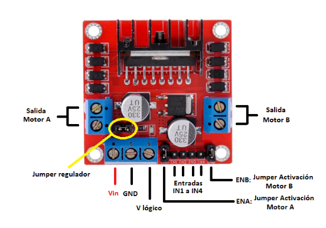

#**PRÁCTICAS PRIMER SEMESTRE**

##Microcontroladores 

##SP32

<!-- Control de tamaño usando HTML (cuando se requiera) -->


  + El ESP32 es un microcontrolador, al igual que el Arduino, pero tiene conectividad Bluetooth y WiFi ya integrada en la placa. Esto facilita mucho los proyectos de IoT, ya que intercambiarán información constantemente con la red.


??? info "Antes de iniciar"
    Toda la programación se realiza con el programa arduino, asi mismo asegurate de tener descargada la biblioteca ESP 32 by Arduino.

    
 	###Práctica 1
  
+	**Materiales:** 
+	ESP 32
+	1 resistencia de 1K
+	Jumpers
+	Led
+	Botón
+	Resistencia de 10k

#Parte 1:
[Video Botón](https://youtube.com/shorts/-1IOQ58C9as?feature=share)

<!-- Control de tamaño usando HTML (cuando se requiera) -->


``` codigo
  const int led = 33;
  const int led = 25;
  void setup(){
    serial.begin(115200); //INICIO DE LA COMUNICACION
  pinMode(led, OUTPUT);
  pinMode(btn, INPUT);
  }
  void loop(){
    int estado= digitalRead(btn);
    if (estado==1){
      digitalWrite(led,1);
    }
  else{
    digitalWrite(led,0)
  }
} 
```

#Parte 2: Conectar ESP32 por Bluetooth

Para poder controlar la ESP32 se utiliza la aplicación "Serial Bluetooth Terminal"

??? info "Antes de iniciar" 
Los teléfonos iPhone no se pueden conectar a la aplicación por lo que se puede probar con dispositivos Android o una computadora con Bluetooth

[Video Bluetooth](https://youtube.com/shorts/YmqibzFyFkQ?si=xfnZ4DQk0jpMGE2k)


``` codigo
  const int led = 33;
  const int led = 25;
  void setup(){
    serial.begin(115200); //INICIO DE LA COMUNICACION
    serialBT.begin ("Arduinito") // Nombre del dispositivo Bluetooth
  }
  void loop(){
    if (SerialBT.available()){
          String mensaje= SerialBT.readString();
          Serial.printlin("Recibido: "+mensaje);
      if (mensaje==1){
      digitalWrite(led,1);
    }
    else{
    digitalWrite(led,0)
     }
  }
  delay (1000);
}
```

###Práctica 2
  
+	**Materiales:** 
+	ESP 32
+	Jumpers
+	Motor
+	Puente H

<!-- Control de tamaño usando HTML (cuando se requiera) -->


##Puente H

<!-- Control de tamaño usando HTML (cuando se requiera) -->

  
+	El puente H es un circuito electrónico que se utiliza para controlar el movimiento de motores, en particular motores de corriente continua (DC). Su nombre se debe a la forma típica del circuito, que se asemeja a la letra «H». El principal objetivo del puente H es permitir que un motor gire en ambas direcciones: hacia adelante y hacia atrás. Para lograr esto, se utilizan conmutadores o interruptores, que pueden ser mecánicos (como relés) o electrónicos (como transistores).
+	El puente H se conecta siguiendo el siguiente diagrama:
  <!-- Control de tamaño usando HTML (cuando se requiera) -->


#Parte 1:
El siguiente video se puede observar el funcionamiento objetivo de esta práctica:

[Video motor parte 1](https://youtu.be/1-iVSy3lYFE)

<!-- Control de tamaño usando HTML (cuando se requiera) -->


``` codigo
  #define in1 2
  #define in2 15
  void setup(){
    pinMode(in1, OUTPUT);
    pinMode(in2, OUTPUT);
  }
  void loop(){
   digitalWrite (in1,1);
   digitalWrite (in2,0);
   delay(4000);
   digitalWrite (in1,0);
   digitalWrite (in2,0);
   delay(2000);
   digitalWrite (in1,0);
   digitalWrite (in2,1);
   delay(4000);
} 
```

##PWM
La Modulación por Ancho de Pulso (PWM) es una técnica que permite simular una señal analógica utilizando una señal digital que alterna rápidamente entre los estados HIGH y LOW. Esto es útil para controlar dispositivos como LEDs, motores y altavoces, ajustando su brillo, velocidad o tono, respectivamente.

Funcionamiento de PWM en Arduino

Arduino utiliza temporizadores internos para generar señales PWM en pines específicos marcados con el símbolo ~. La función principal para trabajar con PWM es analogWrite(pin, valor), donde el parámetro valor varía entre 0 y 255:

0: La señal estará siempre en LOW.

255: La señal estará siempre en HIGH.

127: La señal estará en HIGH el 50% del tiempo (ciclo de trabajo del 50%).

#Parte 2: Controlar la velocidad de un motor
[Video motor parte 2](https://youtube.com/shorts/-IvpXZFyuBY?si=AdCl1KKyLr1cQX18)


En esta parte de la práctica se programa el ESP32 para controlar la velocidad de un motor, que esta misma aumente progresivamente

``` codigo
  /*Control de 1 solo motor*/
#define in1 14
#define in2 27
#define pwm 25 //Definicion de pin de Velocidad

void setup() {
  /*Declarar Pines Como salida*/
  pinMode(in1, OUTPUT);
  pinMode(in2, OUTPUT);
  /*Configuracion de pin PWM 
    - Se conecta al pin 12(pwm)
    - Frecuencia de 1Khz
    - Resolucion de 8 bit (0-255)
    - Canal 0
  */
  ledcAttachChannel(pwm, 1000, 8, 0);
}

void loop() {
  /*ADELANTE*/
  digitalWrite(in1, 0);
  digitalWrite(in2, 1);
  ledcWrite(pwm, 0);//Velocidad al 0%
  delay(500);
  ledcWrite(pwm, 51);//Velocidad al 20%
  delay(500);
  ledcWrite(pwm, 102);//Velocidad al 40%
  delay(500);
  ledcWrite(pwm, 153);//Velocidad al 60%
  delay(500);
  ledcWrite(pwm, 204);//Velocidad al 80%
  delay(500);
  ledcWrite(pwm, 255);//Velocidad al 100%
  delay(500);
}
}
```

###Práctica 3 : Actuadores
  
+	**Materiales:** 
+	ESP 32
+	Jumpers
+	Motor
+	1 Microservo 9g


 	#Parte 1: 
 	<!-- Control de tamaño usando HTML (cuando se requiera) -->


En esta parte de la práctica se programa un ESP32 para controlar un servomotor, para ir cambiando gradualmente el ángulo 0-90, 0-180 en un ciclo infinito.

[Video servomotor parte 2](https://youtube.com/shorts/IjsgafZaUr0?feature=share)
``` codigo
  #define pwm 27
  int duty = 0;
  int grados=0;
  void setup(){
    /*Declarar Pines de Como salida*/
    pinMode (27, OUTPUT);
    /*Configuracion de pin pwm
    -Se conecta al pin 27 (pwm)
    -Frecuencia de 50hz
    -Resolución de 12 bit (0-4096)
    -Canal
  */
  led AttachChannel (pwm, 50, 12, 0);
  Serial.begin (115200);
}
  void loop(){
/*
  grados=0;
  duty = map (grados, 0, 180, 205, 410);
  Serial.print("Pos: ");
  Serial.printIn (duty);
  ledCWrite(pwm,duty);
  delay(1000);
  grados=90;
  duty = map (grados, 0, 180, 205, 410);
  Serial.print("Pos: ");
  Serial.printIn (duty);
  ledCWrite(pwm,duty);
  delay(1000);
  grados=180;
  duty = map (grados, 0, 180, 205, 410);
  Serial.print("Pos: ");
  Serial.printIn (duty);
  ledCWrite(pwm,duty);
  delay(1000);
} 
```

#Parte 2:
[Video de servomotor girando progresivamente partiendo desde cero](https://youtube.com/shorts/SdGjUoPbMO4?feature=share)

En esta parte el servomotor se programa para ir aumentando progresivamente 10° iniciando desde los 0°.

``` codigo
    #define pwm 27
  int duty = 0;
  int grados=0;
  void setup(){
    pinMode (pwm, OUTPUT);
    //Configuracion de pin pwm
    //Frecuencia de 50hz, Resolución de 12 bit (0-4096), Canal: 0

  led AttachChannel (pwm, 50, 12, 0);
  Serial.begin (115200);
}
  void loop(){
    for(int angulo =10; angulo <= 180; angulo +=10) {
    //Ir a 9°
    grados = 0;
    duty =map (grados,0, 180, 205, 410);
    Serial.print("Pos: ");
    Serial.printIn(duty);
    ledcWrite (pwm,duty);
    delay (1000);
//Ir al ángulo actual
    grados = angulo;
    duty =map (grados,0, 180, 205, 410);
    Serial.print("Pos: ");
    Serial.printIn(duty);
    ledcWrite (pwm,duty);
    delay (1000);
     }
  }
  
}
```
##Proyecto Primer parcial
  
+	**Materiales:** 
+	ESP 32
+	Jumpers
+	2 motores
+	1 Puente H
+	2 llantas de 7cm de diametro
+	1 rueda loca
+	Tornillos
+	Baterias de 12V 


 	##Diseño: 
Para este carro se inspiro en una camioneta Jeep, la camioneta presentada tiene detalles en vinil como lo son las flamas, letras con el nombre de la universidad, acrilico para las ventanas para simular los cristales, la carrocería del carro fue cortada en MDF con corte laser

``` codigo
 #include "BluetoothSerial.h"
BluetoothSerial SerialBT;
// Pines del puente H
const int IN1 = 4; // Motor izquierdo
const int IN2 = 16;
const int ENA = 2; //PWM
const int IN3 = 17; // Motor derecho
const int IN4 = 18;
const int ENB = 19;
int valSpeed = 255; //PWM
 
  Serial.begin(115200);
 
  SerialBT.begin("Otrocarrito"); // Nombre del dispositivo Bluetooth
  pinMode(IN1, OUTPUT); //Motor derecho
  pinMode(IN2, OUTPUT);
  pinMode(ENA, OUTPUT);
  pinMode(IN3, OUTPUT);//Motor izquierdo
  pinMode(IN4, OUTPUT);
  pinMode(ENB, OUTPUT);
  stopMotors();
}
 
void loop() {
  if (SerialBT.available()) {
    char command = SerialBT.read();
    Serial.println(command);
    switch (command) {
      case 'F': forward(); break;  //Adelante
      case 'B': backward(); break; //Atras
      case 'L': turnLeft(); break; //Izquierda
      case 'R': turnRight(); break;//Derecha
      case 'S': stopMotors(); break;//Detenerse
      case '0': setSpeed(0); break;
      case '1': setSpeed(25); break;
      case '2': setSpeed(50); break;
      case '3': setSpeed(75); break;
      case '4': setSpeed(100); break;
      case '5': setSpeed(125); break;
      case '6': setSpeed(150); break;
      case '7': setSpeed(175); break;
      case '8': setSpeed(200); break;
      case '9': setSpeed(255); break;
    }
  }
 
}
 
void forward() {
  analogWrite(ENA, valSpeed);
  analogWrite(ENB, valSpeed);
  digitalWrite(IN1, HIGH);
  digitalWrite(IN2, LOW);
  digitalWrite(IN3, HIGH);
  digitalWrite(IN4, LOW);
}
 
void backward() {
  analogWrite(ENA, valSpeed);
  analogWrite(ENB, valSpeed);
  digitalWrite(IN1, LOW);
  digitalWrite(IN2, HIGH);
  digitalWrite(IN3, LOW);
  digitalWrite(IN4, HIGH);
}
 
void turnLeft() {
  analogWrite(ENA, valSpeed / 2);
  analogWrite(ENB, valSpeed);
  digitalWrite(IN1, HIGH);
  digitalWrite(IN2, LOW);
  digitalWrite(IN3, HIGH);
  digitalWrite(IN4, LOW);
}
 
void turnRight() {
  analogWrite(ENA, valSpeed);
  analogWrite(ENB, valSpeed / 2);
  digitalWrite(IN1, HIGH);
  digitalWrite(IN2, LOW);
  digitalWrite(IN3, HIGH);
  digitalWrite(IN4, LOW);
}
 
void stopMotors() {
  analogWrite(ENA, 0);
  analogWrite(ENB, 0);
  digitalWrite(IN1, LOW);
  digitalWrite(IN2, LOW);
  digitalWrite(IN3, LOW);
  digitalWrite(IN4, LOW);
}
 
void setSpeed(int val) {
 
  valSpeed = val;
 
}
```
##Funcionamiento
Se utilizo una aplicación externa para controlar el movimiento del carrito.
En el siguiente video es posible observar el funcionamiento piloto del proyecto:

[Pruebas piloto](https://youtube.com/shorts/-BoEvhaO5zg?feature=share)

Pese a haber sido eficiente en sus pruebas piloto, el día de la competencia sufrio contratiempos inesperados como se puede observar en el siguiente video:

[Video de competencia](https://youtu.be/CgaybSU6_40?si=fNyFkTOkUv3oFaG8)

Se llega a la siguiente conclusión: Hay mejoras estructurales que podrían cambiarse en un siguiente proyecto, detalles a tomar en cuenta y hacer más pruebas con el proyecto previo a la entrega.

## 1) Proyecto final
 
- **Nombre del proyecto:** _Balancin con Reconocimiento de Camara_  
- **Equipo / Autor(es):** _Emily Mendez, Aldo Fernandez, Alexandra Groot, Valeria Piña_  
- **Curso / Asignatura:** _Introducción a la Mecatrónica_  
- **Fecha:** _24/11/2025_  
- **Descripción breve:** _Desarrollo de una plataforma con cámara que balancee una pelota, utilizando servomotores y el reconocimento de colores desde Python._
  
 
## 2) Objetivos
 
**General:**  
_Diseñar y construir un sistema que mantenga una pelota centrada sobre una plataforma utilizando visión por computadora y control PID._
 
**Específicos:**
- _Procesar la imagen de la cámara en Python para detectar la pelota._
  
- _Enviar los datos obtenidos al Arduino mediante Bluetooth._
  
- _Implementar control PID que ajuste los servomotores para estabilizar la plataforma._
 
 
## 3) Alcance y Exclusiones
 
- **Incluye:** _El proyecto contempla un mes de trabajo partiendo del código base proporcionado por el profesor, realizando modificaciones necesarias para adaptar el reconocimiento por cámara, la comunicación con Arduino y el control del mecanismo. Incluye también el diseño y fabricación del balancín y los soportes de servomotores._
 
 
## 4) Planeación
La planeación del proyecto se estructuró en tres etapas principales:
 
1. Ajustes al código base:
Modificación del código de Arduino para interpretar correctamente los comandos enviados desde Python.
2. Diseño mecánico en SolidWorks:
Creación de los soportes para servomotores y del punto de apoyo del centro, siendo estos impresas en 3D y cortadas en MDF.
3. Integración y calibración:
Ensamble completo y ajustes de los parámetros del PID para lograr un movimiento estable del balancín.
 
 
## 5) Desarrollo
 
### Diseño
El diseño del balancín se basó en un mecanismo previamente visto en un video, adaptándolo a las necesidades del proyecto. Se incorporaron dos soportes laterales para servomotores y un soporte central con esfera para permitir el movimiento en los ejes X y Y.
Las piezas que sostienen a los servomotores y la esfera de la mitad fueron impresas en 3D, y los demas materiales fueron cortados en MDF.
 

 
 
### Programación
El desarrollo del código incluye:
 
- Detección de la pelota mediante filtros HSV en Python.
- Cálculo del error respecto al centro de la imagen.
- Envío de instrucciones por Bluetooth hacia el Arduino.
- Implementación de un controlador PID en Arduino para mover los servos de acuerdo con el error.
- El sistema funciona de manera continua, permitiendo un ajuste constante de la plataforma para mantener la pelota dentro de la zona deseada.
 
### Código Arduino
 
```cpp
#include <BluetoothSerial.h>
#include <ESP32Servo.h>
 
BluetoothSerial SerialBT;
 
Servo servoX;
Servo servoY;
 
// Configuración de servos
// LÍMITES CORREGIDOS: X toma los límites que tenía Y y viceversa
const int MIN_ANG_X = 120;   // Servo X mínimo
const int MAX_ANG_X = 30;    // Servo X máximo
const int CENTER_X = 100;    // Centro aproximado
 
const int MIN_ANG_Y = 100;   // Servo Y mínimo
const int MAX_ANG_Y = 10;    // Servo Y máximo
const int CENTER_Y = 85;     // Centro aproximado
 
// PID más rápido
float Kp = 1.0;  
float Ki = 0.01;
float Kd = 0.2;
 
// Variables X  
int eX = 0;
float integralX = 0;
float prevErrorX = 0;
float posX = CENTER_X;
 
// Variables Y
int eY = 0;
float integralY = 0;
float prevErrorY = 0;
float posY = CENTER_Y;
 
// Suavizado
float maxStep = 3.0;  // ligeramente mayor para movimientos más rápidos
 
unsigned long lastTime = 0;
 
void setup() {
  Serial.begin(115200);
  SerialBT.begin("ESPbalancin");
 
  servoX.attach(27);
  servoY.attach(14);
  servoX.write(posX);
  servoY.write(posY);
 
  lastTime = millis();
  Serial.println("PID rápido con límites X/Y intercambiados listo");
}
 
void loop() {
  unsigned long now = millis();
  float dt = (now - lastTime) / 1000.0;
  if (dt <= 0) dt = 0.001;
 
  // Leer errores de Bluetooth
  while (SerialBT.available()) {
    String cmd = SerialBT.readStringUntil('\n');
    cmd.trim();
    if (cmd.startsWith("EX:")) eX = cmd.substring(3).toInt();
    else if (cmd.startsWith("EY:")) eY = cmd.substring(3).toInt();
  }
 
  // ===== PID X =====
  float errorX_PID = -eX;  // invertir X
  integralX += errorX_PID * dt;
  float derivativeX = (errorX_PID - prevErrorX) / dt;
  float outputX = Kp * errorX_PID + Ki * integralX + Kd * derivativeX;
  float targetX = CENTER_X + outputX;
 
  // Suavizado
  float diffX = targetX - posX;
  if (abs(diffX) > maxStep) posX += (diffX > 0 ? maxStep : -maxStep);
  else posX = targetX;
 
  posX = constrain(posX, MIN_ANG_X, MAX_ANG_X);
  prevErrorX = errorX_PID;
 
  // ===== PID Y =====
  float errorY_PID = -eY;  
  integralY += errorY_PID * dt;
  float derivativeY = (errorY_PID - prevErrorY) / dt;
  float outputY = Kp * errorY_PID + Ki * integralY + Kd * derivativeY;
  float targetY = CENTER_Y + outputY;
 
  float diffY = targetY - posY;
  if (abs(diffY) > maxStep) posY += (diffY > 0 ? maxStep : -maxStep);
  else posY = targetY;
 
  posY = constrain(posY, MIN_ANG_Y, MAX_ANG_Y);
  prevErrorY = errorY_PID;
 
  // Mover servos
  servoX.write(posX);
  servoY.write(posY);
 
  lastTime = now;
 
  Serial.printf("EX=%d EY=%d | posX=%.1f posY=%.1f\n", eX, eY, posX, posY);
  delay(20);
}
```
 
---
 
### Código Python
 
```python
import cv2
import numpy as np
import bluetooth
import time
 
# Configuración Bluetooth
port = 1
sock = bluetooth.BluetoothSocket()
sock.settimeout(15)
 
print("Conectando a ESP32...")
while True:
    try:
        sock.connect(("6C:C8:40:4D:AE:E6", port))  # Cambia por tu MAC
        print("✔ Conectado a ESP32.")
        break
    except Exception as e:
        print("Reintentando conexión:", e)
    time.sleep(1)
 
video = cv2.VideoCapture(1)
time.sleep(0.5)
 
while True:
    ret, frame = video.read()
    if not ret:
        break
 
    # Rotar 90 grados a la derecha
    frame = cv2.rotate(frame, cv2.ROTATE_90_CLOCKWISE)
 
    hsv = cv2.cvtColor(frame, cv2.COLOR_BGR2HSV)
 
    low = np.array([100, 60, 40], dtype=np.uint8)
    high = np.array([130, 255, 255], dtype=np.uint8)
    mask = cv2.inRange(hsv, low, high)
 
    contours, _ = cv2.findContours(mask, cv2.RETR_EXTERNAL, cv2.CHAIN_APPROX_SIMPLE)
 
    centrox = frame.shape[1] // 2
    centroy = frame.shape[0] // 2
 
    # Dibuja centro de cámara (verde)
    cv2.circle(frame, (centrox, centroy), 5, (0, 255, 0), 2)
 
    if contours:
        cont = max(contours, key=cv2.contourArea)
        (x, y), radius = cv2.minEnclosingCircle(cont)
        x, y = int(x), int(y)
 
        # Dibuja centro de la pelota (rojo)
        cv2.circle(frame, (x, y), 5, (0, 0, 255), -1)
        cv2.circle(frame, (x, y), int(radius), (0, 255, 255), 2)
 
        ErrorX_raw = x - centrox
        ErrorY_raw = y - centroy
 
        # Ajuste por rotación 90° y control diagonal invertido
        ErrorX = -ErrorY_raw  # invertir eje X
        ErrorY = ErrorX_raw   # invertir eje Y
 
        # Envía errores
        try:
            sock.send(f"EX:{ErrorX}\n".encode())
            sock.send(f"EY:{ErrorY}\n".encode())
        except:
            pass
 
        cv2.putText(frame, f"EX:{ErrorX} EY:{ErrorY}", (20, 40),
                    cv2.FONT_HERSHEY_SIMPLEX, 0.7, (0, 255, 0), 2)
 
    cv2.imshow("Camara", frame)
    cv2.imshow("Mascara", mask)
 
    if cv2.waitKey(1) & 0xFF == ord('q'):
        break  
 
video.release()
cv2.destroyAllWindows()
sock.close()
 
```
 
---
 
## 6) Resultados y Evidencias


 
### Videos
[Funcionamiento 1](https://youtube.com/shorts/w0CxEOn6TXU?feature=share)
 
[Funcionamiento 2](https://youtube.com/shorts/BMnnWa4znkY?feature=share)
 
[Funcionamiento 3](https://youtube.com/shorts/F7ZjY1F8WCc?si=3SutnnJn3M5vtqOd]) 
## 7) Conclusiones
El proyecto permitió poner en practica los conceptos de mecatrónica, combinando diseño, control y visión por computadora. El sistema final demuestra cómo el uso de reconocimiento por cámara y control PID puede aplicarse a un mecanismo basico como balancear una pelota, a sistemas mas complejos que permiten que un proyecto funcione de manera apropiada.
 
También se destaca la importancia de una buena organización y tiempos de trabajo definidos para lograr un proyecto exitoso.
 
$$ 
{}^{0}_{1}T =
\begin{bmatrix}
\cos\theta_{1} & -\sin\theta_{i} & 0 & a_{1}\cos\theta_{1} \\
\sin\theta_{1} & \cos\theta_{i} & 0 & a_{1}\sin\theta_{1} \\
0 & 0 & 1 & 0 \\
0 & 0 & 0 & 1
\end{bmatrix}
$$
