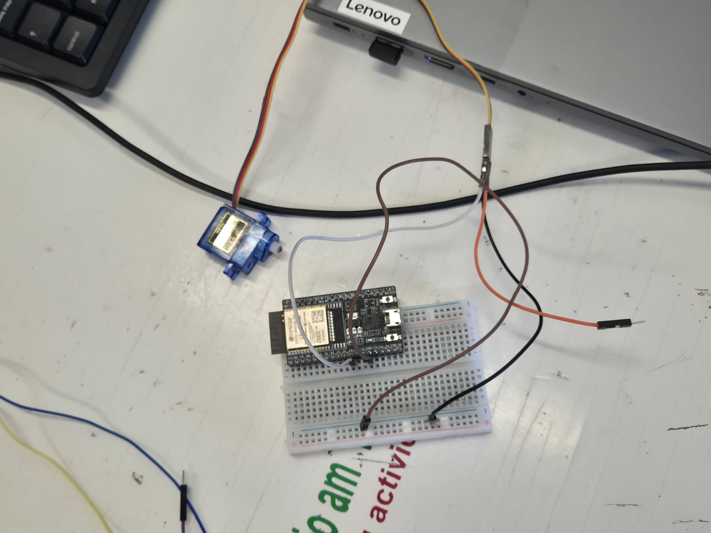

#**PRÁCTICAS PRIMER SEMESTRE**

##Microcontroladores 

##SP32

<!-- Control de tamaño usando HTML (cuando se requiera) -->


  + El ESP32 es un microcontrolador, al igual que el Arduino, pero tiene conectividad Bluetooth y WiFi ya integrada en la placa. Esto facilita mucho los proyectos de IoT, ya que intercambiarán información constantemente con la red.


??? info "Antes de iniciar"
    Toda la programación se realiza con el programa arduino, asi mismo asegurate de tener descargada la biblioteca ESP 32 by Arduino.

    
 	###Práctica 1
  
+	**Materiales:** 
+	ESP 32
+	1 resistencia de 1K
+	Jumpers
+	Led
+	Botón

 	#Parte 1: 
 	<!-- Control de tamaño usando HTML (cuando se requiera) -->


``` codigo
  const int led = 33;
  const int led = 25;
  void setup(){
    serial.begin(115200); //INICIO DE LA COMUNICACION
  pinMode(led, OUTPUT);
  pinMode(btn, INPUT);
  }
  void loop(){
    int estado= digitalRead(btn);
    if (estado==1){
      digitalWrite(led,1);
    }
  else{
    digitalWrite(led,0)
  }
} 
```

#Parte 2: Conectar ESP32 por Bluetooth
 	<!-- Control de tamaño usando HTML (cuando se requiera) -->


``` codigo
  const int led = 33;
  const int led = 25;
  void setup(){
    serial.begin(115200); //INICIO DE LA COMUNICACION
    serialBT.begin ("Arduinito") // Nombre del dispositivo Bluetooth
  }
  void loop(){
    if (SerialBT.available()){
          String mensaje= SerialBT.readString();
          Serial.printlin("Recibido: "+mensaje);
      if (mensaje==1){
      digitalWrite(led,1);
    }
    else{
    digitalWrite(led,0)
     }
  }
  delay (1000);
}
```

###Práctica 2
  
+	**Materiales:** 
+	ESP 32
+	Jumpers
+	Motor
+	Puente H

<!-- Control de tamaño usando HTML (cuando se requiera) -->


##Puente H

<!-- Control de tamaño usando HTML (cuando se requiera) -->

  
+	El puente H es un circuito electrónico que se utiliza para controlar el movimiento de motores, en particular motores de corriente continua (DC). Su nombre se debe a la forma típica del circuito, que se asemeja a la letra «H». El principal objetivo del puente H es permitir que un motor gire en ambas direcciones: hacia adelante y hacia atrás. Para lograr esto, se utilizan conmutadores o interruptores, que pueden ser mecánicos (como relés) o electrónicos (como transistores).


 	#Parte 1: 
 	<!-- Control de tamaño usando HTML (cuando se requiera) -->


``` codigo
  #define in1 2
  #define in2 15
  void setup(){
    pinMode(in1, OUTPUT);
    pinMode(in2, OUTPUT);
  }
  void loop(){
   digitalWrite (in1,1);
   digitalWrite (in2,0);
   delay(4000);
   digitalWrite (in1,0);
   digitalWrite (in2,0);
   delay(2000);
   digitalWrite (in1,0);
   digitalWrite (in2,1);
   delay(4000);
} 
```

#Parte 2: Controlar la velocidad de un motor

 	<!-- Control de tamaño usando HTML (cuando se requiera) -->


En esta parte de la práctica se programa el ESP32 para controlar la velocidad de un motor, que esta misma aumente progresivamente

``` codigo
  /*Control de 1 solo motor*/
#define in1 14
#define in2 27
#define pwm 25 //Definicion de pin de Velocidad

void setup() {
  /*Declarar Pines Como salida*/
  pinMode(in1, OUTPUT);
  pinMode(in2, OUTPUT);
  /*Configuracion de pin PWM 
    - Se conecta al pin 12(pwm)
    - Frecuencia de 1Khz
    - Resolucion de 8 bit (0-255)
    - Canal 0
  */
  ledcAttachChannel(pwm, 1000, 8, 0);
}

void loop() {
  /*ADELANTE*/
  digitalWrite(in1, 0);
  digitalWrite(in2, 1);
  ledcWrite(pwm, 0);//Velocidad al 0%
  delay(500);
  ledcWrite(pwm, 51);//Velocidad al 20%
  delay(500);
  ledcWrite(pwm, 102);//Velocidad al 40%
  delay(500);
  ledcWrite(pwm, 153);//Velocidad al 60%
  delay(500);
  ledcWrite(pwm, 204);//Velocidad al 80%
  delay(500);
  ledcWrite(pwm, 255);//Velocidad al 100%
  delay(500);
}
}
```
###Práctica 3 : Actuadores
  
+	**Materiales:** 
+	ESP 32
+	Jumpers
+	Motor
+	1 Microservo 9g


 	#Parte 1: 
 	<!-- Control de tamaño usando HTML (cuando se requiera) -->


En esta parte de la práctica se programa un ESP32 para controlar un servomotor, para ir cambiando gradualmente el ángulo 0-90, 0-180 en un ciclo infinito.

``` codigo
  #define pwm 27
  int duty = 0;
  int grados=0;
  void setup(){
    /*Declarar Pines de Como salida*/
    pinMode (27, OUTPUT);
    /*Configuracion de pin pwm
    -Se conecta al pin 27 (pwm)
    -Frecuencia de 50hz
    -Resolución de 12 bit (0-4096)
    -Canal
  */
  led AttachChannel (pwm, 50, 12, 0);
  Serial.begin (115200);
}
  void loop(){
/*
  grados=0;
  duty = map (grados, 0, 180, 205, 410);
  Serial.print("Pos: ");
  Serial.printIn (duty);
  ledCWrite(pwm,duty);
  delay(1000);
  grados=90;
  duty = map (grados, 0, 180, 205, 410);
  Serial.print("Pos: ");
  Serial.printIn (duty);
  ledCWrite(pwm,duty);
  delay(1000);
  grados=180;
  duty = map (grados, 0, 180, 205, 410);
  Serial.print("Pos: ");
  Serial.printIn (duty);
  ledCWrite(pwm,duty);
  delay(1000);
} 
```

#Parte 2:
 	<!-- Control de tamaño usando HTML (cuando se requiera) -->


En esta parte el servomotor se programa para ir aumentando progresivamente 10° iniciando desde los 0°.

``` codigo
    #define pwm 27
  int duty = 0;
  int grados=0;
  void setup(){
    pinMode (pwm, OUTPUT);
    //Configuracion de pin pwm
    //Frecuencia de 50hz, Resolución de 12 bit (0-4096), Canal: 0

  led AttachChannel (pwm, 50, 12, 0);
  Serial.begin (115200);
}
  void loop(){
    for(int angulo =10; angulo <= 180; angulo +=10) {
    //Ir a 9°
    grados = 0;
    duty =map (grados,0, 180, 205, 410);
    Serial.print("Pos: ");
    Serial.printIn(duty);
    ledcWrite (pwm,duty);
    delay (1000);
//Ir al ángulo actual
    grados = angulo;
    duty =map (grados,0, 180, 205, 410);
    Serial.print("Pos: ");
    Serial.printIn(duty);
    ledcWrite (pwm,duty);
    delay (1000);
     }
  }
  
}
```
##Proyecto Primer parcial
  
+	**Materiales:** 
+	ESP 32
+	Jumpers
+	2 motores
+	1 Puente H
+	2 llantas de 7cm de diametro
+	1 rueda loca
+	Tornillos


 	#Diseño: 
 	<!-- Control de tamaño usando HTML (cuando se requiera) -->


Para este carro se baso en una camioneta Jeep, la camioneta presentada tiene detalles en vinil como lo son las flamas, letras con el nombre de la universidad, acrilico para las ventanas para simular los cristales, la carrocería del carro fue cortada en MDF con corte laser

``` codigo
 #include "BluetoothSerial.h"
BluetoothSerial SerialBT;
// Pines del puente H
const int IN1 = 21; // Motor izquierdo
const int IN2 = 17;
const int ENA = 18;
const int IN3 = 16; // Motor derecho
const int IN4 = 19;
const int ENB = 5;
int valSpeed = 255;
void setup() {
 
  Serial.begin(115200);
 
  SerialBT.begin("Terreneitor"); // Nombre del dispositivo Bluetooth
  pinMode(IN1, OUTPUT);
  pinMode(IN2, OUTPUT);
  pinMode(ENA, OUTPUT);
  pinMode(IN3, OUTPUT);
  pinMode(IN4, OUTPUT);
  pinMode(ENB, OUTPUT);
  stopMotors();
}
 
void loop() {
  if (SerialBT.available()) {
    char command = SerialBT.read();
    Serial.println(command);
    switch (command) {
      case 'F': forward(); break;
      case 'B': backward(); break;
      case 'L': turnLeft(); break;
      case 'R': turnRight(); break;
      case 'S': stopMotors(); break;
      case '0': setSpeed(0); break;
      case '1': setSpeed(25); break;
      case '2': setSpeed(50); break;
      case '3': setSpeed(75); break;
      case '4': setSpeed(100); break;
      case '5': setSpeed(125); break;
      case '6': setSpeed(150); break;
      case '7': setSpeed(175); break;
      case '8': setSpeed(200); break;
      case '9': setSpeed(255); break;
    }
  }
 
}
 
void forward() {
  analogWrite(ENA, valSpeed);
  analogWrite(ENB, valSpeed);
  digitalWrite(IN1, HIGH);
  digitalWrite(IN2, LOW);
  digitalWrite(IN3, HIGH);
  digitalWrite(IN4, LOW);
}
 
void backward() {
  analogWrite(ENA, valSpeed);
  analogWrite(ENB, valSpeed);
  digitalWrite(IN1, LOW);
  digitalWrite(IN2, HIGH);
  digitalWrite(IN3, LOW);
  digitalWrite(IN4, HIGH);
}
 
void turnLeft() {
  analogWrite(ENA, valSpeed / 2);
  analogWrite(ENB, valSpeed);
  digitalWrite(IN1, HIGH);
  digitalWrite(IN2, LOW);
  digitalWrite(IN3, HIGH);
  digitalWrite(IN4, LOW);
}
 
void turnRight() {
  analogWrite(ENA, valSpeed);
  analogWrite(ENB, valSpeed / 2);
  digitalWrite(IN1, HIGH);
  digitalWrite(IN2, LOW);
  digitalWrite(IN3, HIGH);
  digitalWrite(IN4, LOW);
}
 
void stopMotors() {
  analogWrite(ENA, 0);
  analogWrite(ENB, 0);
  digitalWrite(IN1, LOW);
  digitalWrite(IN2, LOW);
  digitalWrite(IN3, LOW);
  digitalWrite(IN4, LOW);
}
 
void setSpeed(int val) {
 
  valSpeed = val;
 
}
```

